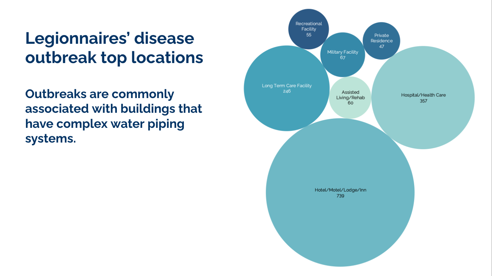
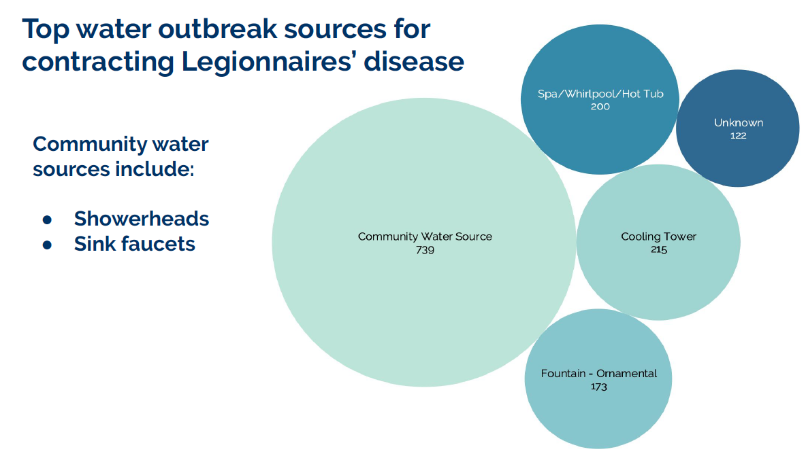
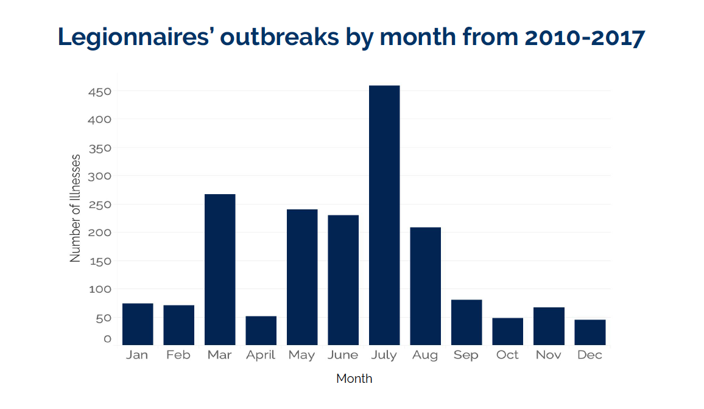
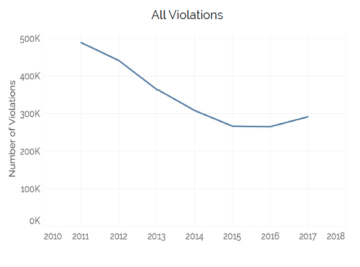
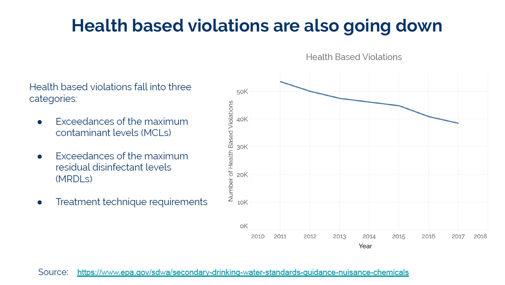

# Will Legionnaires' disease be the next US epidemic?

**Motivation**
“To do something helpful in the time of Covid.”     
With office buildings being closed during the Covid-19 Pandemic (stagnant water), could this make conditions ripe for a Legionnaires' outbreak?  Is there a correlation between water system violations and increased Legionnaires' cases?

**Initial Questions:**  

Will Legionnaires' be the next US epidemic?  
Have water system violations increased over time?  
Is there a correlation between the two?

**Data**

National Outbreak Reporting System (NORS)

Centers for Disease Control (CDC)

Enforcement and Compliance History Online (Echo)

Environmental Protection Agency (EPA)

Census State Population

Wonder.cdc.gov

**Analysis**

Legionella likes warm, hot, humid climates

Legionnaires' cases are constantly rising

add gif

Is there a link to Community Water System Violations?

Community Water System Violations are going down

Health Based Violations are going down

**Conclusion**
While typically Legionella has colonized in buildings like hotels and hospitals - office buildings along with other buildings that have been shut down during the Covid-19 pandemic, may now pose a new risk for outbreaks.

